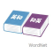

#  WordNet translation APIs MSP Connector

## Description

A generated MSP connector for the WordNet translation APIs API (version 0.0.1).

Generated from: https://api.apis.guru/v2/specs/apitore.com/wordnetTranslationApis/0.0.1/swagger.json 
Generated at: 2019-05-07T11:17:12+03:00

## API Description

Return translation words. [Endpoint] https://api.apitore.com/api/45

## Authorization

This API does not require authorization.

## Actions

### Simple WordNet WebAPI. Return translation words.

> Japanese WordNet. Response &nbsp; Github: <a href="https://github.com/keigohtr/apitore-response-parent/tree/master/wordnet-response">wordnet-response</a> &nbsp; Class: com.apitore.banana.response.de.sciss.ws4j.LinksResponseEntity 

*Tags:* `wordnet-simple-parts-controller`

#### Input Parameters
* `access_token` - _required_ - Access Token
* `word` - _required_ - Word
* `pos` - _optional_ - Part-of-speech. You can specify several pos by csv format. [n:noun,v:verb,a:adjective,r:adverb]

## License

flowground :- Telekom iPaaS / apitore-com-wordnet-translation-apis-connector 
Copyright © 2019, [Deutsche Telekom AG](https://www.telekom.de) 
contact: flowground@telekom.de

All files of this connector are licensed under the Apache 2.0 License. For details
see the file LICENSE on the toplevel directory.
